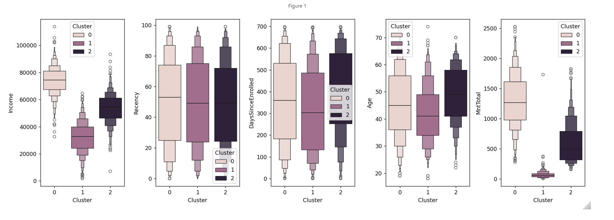
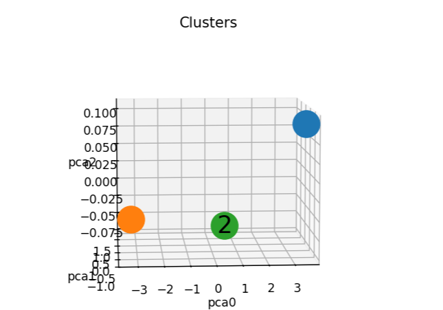
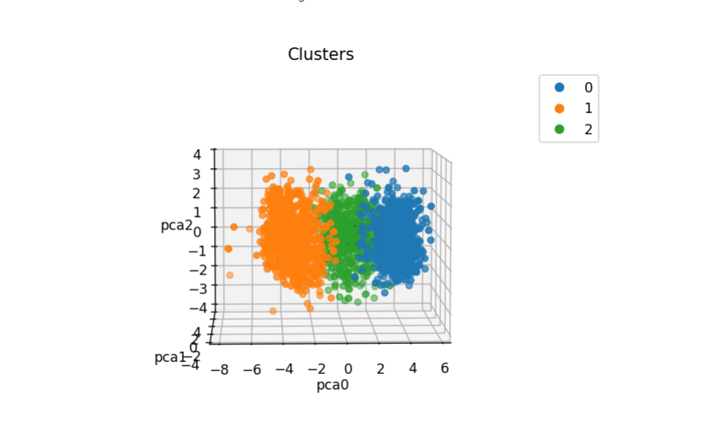
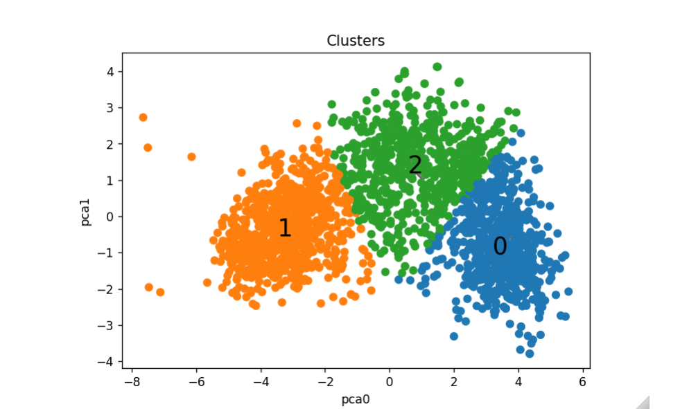
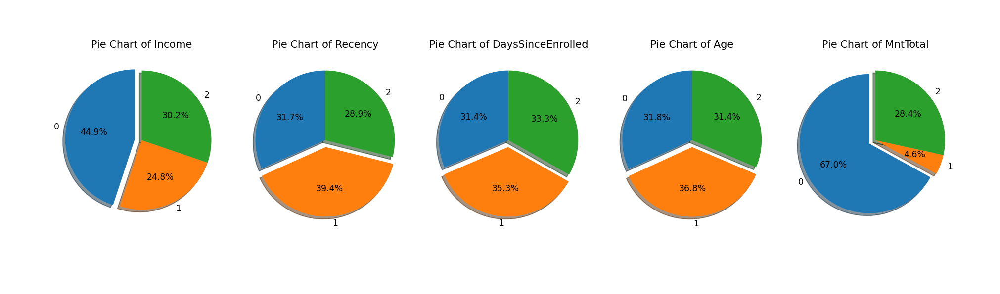
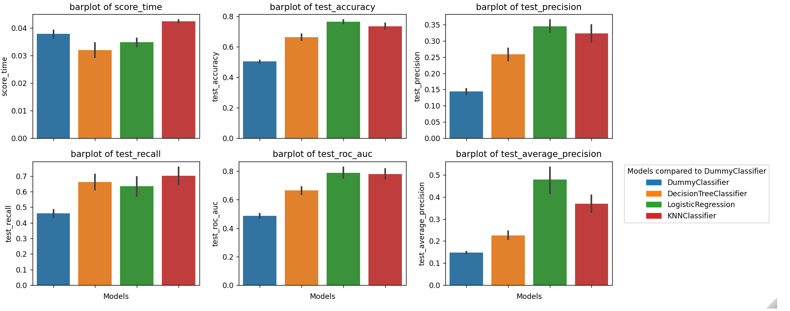

(www.linkedin.com/in/vinicius-monteiro-pina)
[](https://www.python.org/)

# Case iFood - Data Analyst


Consider a well-established Brazilian company operating in the food retail sector. Currently, they have several thousand registered customers and serve nearly a million consumers annually. They sell products in 5 major categories: wines, meats, exotic fruits, specially prepared fish, and sweet products. These can be further divided into gold and regular products. Customers can order and purchase products through 3 sales channels: physical stores, catalogs, and the company's website. Globally, the company has had solid revenues and a healthy bottom line over the past 3 years, but the profit growth outlook for the next 3 years is not promising... For this reason, several strategic initiatives are being considered to reverse this situation. One of them is to improve the performance of marketing activities, with a special focus on marketing campaigns.



[Github](https://github.com/ViniciusPina).


<div style="text-align: center;">
  <a href="https://www.linkedin.com/in/vinicius-monteiro-pina" target="_blank">
    
  </a>
</div>


## Objetivos

The objective of this project is to show students how to structure a project for a selection process that was applied in real life.

During the course, I showed the importance of data preprocessing, as well as the importance of performing exploratory data analysis. Much was discussed about what should be presented in a technical document and what should be presented in a presentation for a non-technical audience.

Detailed objectives:

- Build a robust exploratory analysis.
- Segment the customers from the provided database.
- Build a classification model to predict if a customer will buy the product offered in the campaign.
- Present a Data Science project structure, using notebooks, scripts, reports, and GitHub repository.
- Present good programming practices in Python, such as using functions and script files to facilitate code reuse.
- Show good practices in using SciKit-Learn, such as using pipelines and hyperparameter optimization.

## Repository Structure

```
├── DATA
├── images
├── Models
├── Reports
```

- The `data` estão os dados utilizados no projeto. O arquivo `ml_project1_data.csv` é o dataset utilizado originalmente. Os demais arquivos são os datasets gerados durante o projeto.
- The  `images` estão as imagens utilizadas neste README.
- The  `notebooks` estão os notebooks com o desenvolvimento do projeto.
- The  `reports` estão os relatórios gerados durante o projeto utilizando a biblioteca [ydata-profiling](https://github.com/ydataai/ydata-profiling).

## Dataset Details and Summary of Results


Using a pipeline with preprocessing, PCA, and K-Means, the base was segmented into 3 clusters:







Análise por cluster:



Cluster 0:

 - High income
 - High spending
 - Very likely does not have children
 - More likely to accept campaigns
 - Cluster without people with basic education
 - No standout age profile
Cluster 1:

 - Low income
 - Low spending
 - Likely has children
 - Low propensity to accept campaigns
 - The only cluster with a significant percentage of people with basic education
 - Younger people
Cluster 2:

 - Intermediate income
 - Intermediate spending
 - Likely has children
 - May accept campaigns
 
Older people

Subsequently, three classification models were trained to predict if a customer will buy the product offered in the campaign. The models used were:

- Regressão Logística
- Decision Tree
- KNN

 - A DummyClassifier was used as a baseline. The models were compared based on 6 metrics:



Com base nessa comparação, o modelo de Regressão Logística foi escolhido para passar por uma otimização de hiperparâmetros. 

## How to Reproduce the Project

Version of the Libraries:

-------------------- | ----------
      Library        |  Version  
-------------------- | ----------
Matplotlib           |      3.9.1
NumPy                |     1.24.4
Pandas               |      2.2.2
Scikit-Learn         |      1.5.1
Seaborn              |     0.13.2

Python Version: 3.9.19

These are the main libraries used in the project. The report was generated with the [ydata-profiling](https://github.com/ydataai/ydata-profiling), library, install it if you want to reproduce the report.


## Data Dictionary

Personal Data

 - ID: Unique customer identifier
 - Year_Birth: Customer's birth year
 - Education: Customer's education level
 - Marital_Status: Customer's marital status
 - Income: Customer's annual family income
 - Kidhome: Number of children at customer's home
 - Teenhome: Number of teenagers at customer's home
 - Dt_Customer: Date the customer registered with the company
 - Recency: Number of days since the customer's last purchase
 - Complain: 1 if the customer complained in the last 2 years, 0 otherwise
Product Data

 - MntWines: Amount spent on wine in the last 2 years
 - MntFruits: Amount spent on fruits in the last 2 years
 - MntMeatProducts: Amount spent on meat in the last 2 years
 - MntFishProducts: Amount spent on fish in the last 2 years
 - MntSweetProducts: Amount spent on sweets in the last 2 years
 - MntGoldProds: Amount spent on gold products in the last 2 years
Campaign Data

NumDealsPurchases: Number of purchases made with a discount
 - AcceptedCmp1: 1 if the customer accepted the offer in the 1st campaign, 0 otherwise
 - AcceptedCmp2: 1 if the customer accepted the offer in the 2nd campaign, 0 otherwise
 - AcceptedCmp3: 1 if the customer accepted the offer in the 3rd campaign, 0 otherwise
 - AcceptedCmp4: 1 if the customer accepted the offer in the 4th campaign, 0 otherwise
 - AcceptedCmp5: 1 if the customer accepted the offer in the 5th campaign, 0 otherwise
 - Response: 1 if the customer accepted the offer in the last campaign (pilot), 0 otherwise (target)
Purchase Location Data

 - NumWebPurchases: Number of purchases made through the company's website
 - NumCatalogPurchases: Number of purchases made using a catalog
 - NumStorePurchases: Number of purchases made directly in stores
 - NumWebVisitsMonth: Number of visits to the company's website in the last month - 


